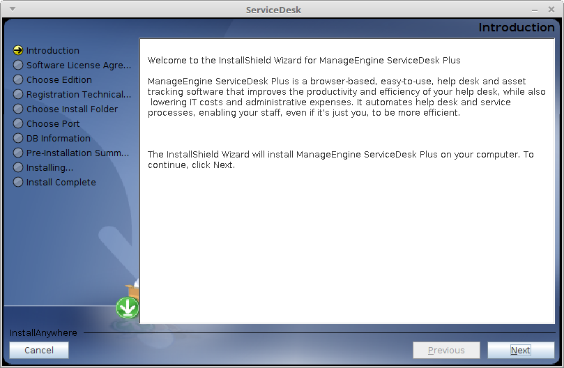

# ManageEngine ServiceDesk Plus

ServiceDesk es un software web para **help desk** de tecnologías de la
información con administración integrada de activos y proyectos.

Es utilizado por más de 120.000 empresas y está disponible en 29 idiomas diferentes.

Dispone de 3 versiones:

* Estandar
	- Gestión de incidentes
	- Portal de autoservicio
	- Base de conocimientos
	- Soporte multi-sitio
	- Administración de SLAs
	- Informes de Help desk
	
* Profesional
	- Administración de Help desk
	- Descubrimiento de activos de TI
	- Administración de activos de software
	- Informes de inventario activos
	- Administración de compras y contratos

* Empresarial
	- Gestión de incidentes
	- Gestión de activos
	- Gestión de problemas
	- Catálogo de servicios
	- Gestión de cambios
	- CMDB

La versión Estandar está disponible completa con un periodo de prueba que permite
hasta 2 técnicos o en versión gratuita sin algunos complementos por un tiempo
ilimitado en la que sólo puede participar el **Administrador** como técnico.

El precio no está disponible, hay que solicitarlo por correo.


# Instalación

ServiceDesk Plus se encuentra disponible en las siguientes plataformas:

* Windows (32/64bits)
* Linux (32/64bits)

El instalador lo podremos encontrar en este enlace: https://www.manageengine.es/service-desk/descargas.html.

En el caso de Linux, debemos dar permisos de ejecución al instalador para poder ejecutarlo:

```
$ chmod +x ManageEngine_ServiceDesk_Plus_64bit.bin

$ ./ManageEngine_ServiceDesk_Plus_64bit.bin
```



Una vez instalado, navegaremos hasta el directorio de instalación y ejecutaremos el comando
`run.sh` en la versión Linux.

Una vez se ha inicializado veremos una pantalla como esta:


En ella se nos indica que ya podemos acceder al software en el enlace: http://localhost:8080 (si
hemos mantenido la configuración por defecto).


# Uso del software

## Primer uso

Una vez accedemos, debemos entrar como **Administrador**, que tendrá configurada una contraseña
por defecto por ser la primera vez que accedemos.

Un mensaje nos indicará que debemos cambiar la contraseña tanto de **Administrador** como del
usuario **Invitado**. Las credenciales por defecto son: **administrator/administrator**.


## Añadir usuarios

Podemos añadir nuevos usuarios llendo a la pestaña **Admin** y luego **Usuarios**.

Ahí veremos que hay 2 tipos de usuarios:

* Solicitantes
* Técnicos

Por defecto, ya existe un usuario solicitante invitado con las credenciales: **Guest/guest**.

En el apartado de **Técnicos** vienen definidos varios técnicos de ejemplo:


## Creación de incidencias

Como usuario **Solicitante** podemos acceder al portal con nuestro usuario y contraseña.

Una vez ahí veremos una serie de opciones:


Tan solo tenemos que clickar en el botón *"Tengo un problema"* y rellenar el formulario:


Como se ve, hay bastantes opciones para categorizar nuestra incidencia así como la posibilidad
de adjuntar archivos de todo tipo.


## Gestión de incidencias

Accediendo con un usuario técnico, en este caso el **Administrador**, podemos ver las incidencias
abiertas en la pestaña *"Solicitudes"*.


Clickando en ella podemos ver todos los datos introducidos por el usuario para nosotros.


Una vez aquí, podemos dar respuesta a la incidencia o reenviarla a otro técnico competente en
dicho área.

Para resolverla vamos a la pestaña *"Resolución"* y escribimos nuestra solución para el usuario.

En caso de que existiera ya una solución anterior similiar, podriamos hacer click en ella para evitar
volver a crearla.


Una vez el usuario confirma que la solución ha funcionado, el técnico puede cerrarla y dar por
finalizada la gestión de la incidencia.


# Conclusiones

* Lo que hemos vista hasta aquí es el uso tradicional que se le da a una herramienta como esta.

* Contiene muchas más posibilidades que dependerán de las necesidades de cada empresa.

* Se trata de un software muy completo y sencillo de utilizar.

* La instalación es muy rápida y libre de problemas.

* Como punto negativo está el que sea un software de pago.
